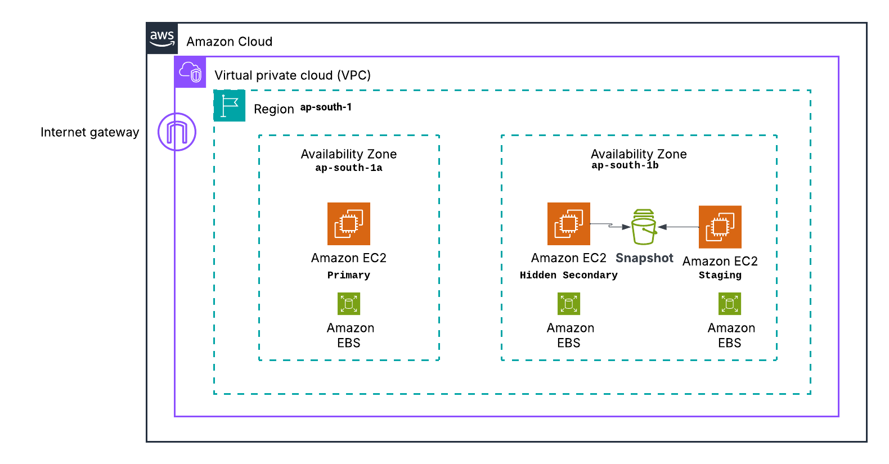

# Sync System — Prod→Staging MongoDB Sync with EBS Snapshot

## AWS Architecture

## Note on Access & Execution

Terraform is used only to set up the infrastructure.
After that, all sync operations run through AWS Systems Manager (SSM) — no SSH needed.

To run the sync scripts, the user or automation role must have permissions for:

- `ssm:SendCommand`
- `ssm:GetCommandInvocation`
- `ssm:GetParameter`
- `EC2 snapshot/volume actions`

MongoDB credentials are not stored in code.
They are securely fetched from SSM Parameter Store `/mongo/admin` and  `/mongo/admin/password`

## Repo layout
- `DESIGN.md`
- `README.md`
- `runbook.md`
- `config-template.yaml` — fill with your environment values
- `scripts/` — automation scripts and anonymizer
- `terraform/` — Provision infra files 

## Prerequisites local machine where you run Make infra
- AWS CLI configured with an IAM principal that can `ssm:SendCommand` for only use local `send-command` automation.
- terraform for infra provisioning — Terraform project already contains infra resources; run terraform steps separately as described in your infra docs
- python3 for anonymizer
- pip packages: `pymongo` for anonymizer
- mongo client optional, for validation

## How to use high level
1. Provision infra with Terraform bootstrap -> main apply ensures S3 backend, VPC, EC2s, EBS, SSM docs exist.
2. Edit `config-template.yaml` copy to `config.yaml` with your real values.
3. Run `scripts/orchestrate.sh config.yaml` this will:
   - trigger snapshot on the secondary (SSM doc),
   - once snapshot is recorded, trigger restore on staging (SSM doc),
   - run anonymizer against staging DB,
   - run verification checks.
4. Check `test-report.md` and logs for verification.

## Important notes
- Do **not** place production credentials in config files; use SSM parameters as configured in infra.
- This orchestration reads production: snapshot request only (read-only). It does not mutate production.
- The anonymizer only runs on staging instance.

